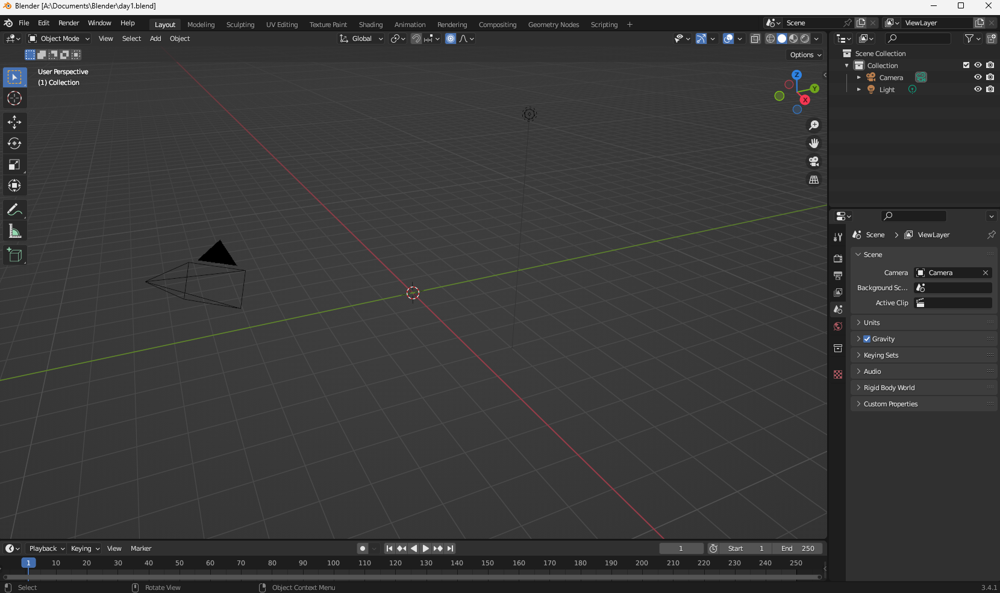

# viewport

## overview

### Menu

- 왼쪽 상단
  - File
  - Edit
  - Render
  - Window
  - Help

### Tools

- Mode 변경
- 스케일, 이동, 회전 툴 등.

#### Select

- w 를 누르면 선택 모드가 바뀜

#### Move

- G (grab)

#### Rotate

- R

> Tip
>
> - Move, Rotate, Scale 상태에서 x, y, z키를 누르면 각 축에 대해서만 조절할 수 있음.

### Multiview

- ctrl + space
  - 여러개의 뷰포트중에 내가 보고있는거를 최대화해서 볼 수 있음. 
  - 다시 ctrl + space 누르면 돌아감.

### Viewmode

- 모드 변경
- shade / modeling 기타 등등

### Outliner

- 필드의 물체를 정리해놓은 폴더

### Properties

- 선택된 도구/오브젝트에 따라 다양한 속성을 바꿀 수 있음.
- Scene / Render에 대한 설정도 이곳에서 하게 됨.

----

- camera
- lamp
- 그리드 1칸 1m

ribbon menu > render > render Image

- 렌더해줌

- 오른쪽 경계에서 우클릭하면, view를 나눌 수 있음.

### Object View Option

- 원하는 타입의 물체만 선택해서 보거나, 클릭 불가 지정 가능.

- 오른쪽의 solid / material / object / wireframe으로 물체 형태 지정 가능.

- 각 옵견에 대해서, 빛의 세기 / 기타 등등 관련된 설정 가능. (자세히 몰루)

#### Object view

- color 랜덤 등 설정해서 오브젝트간 구분 가능.

